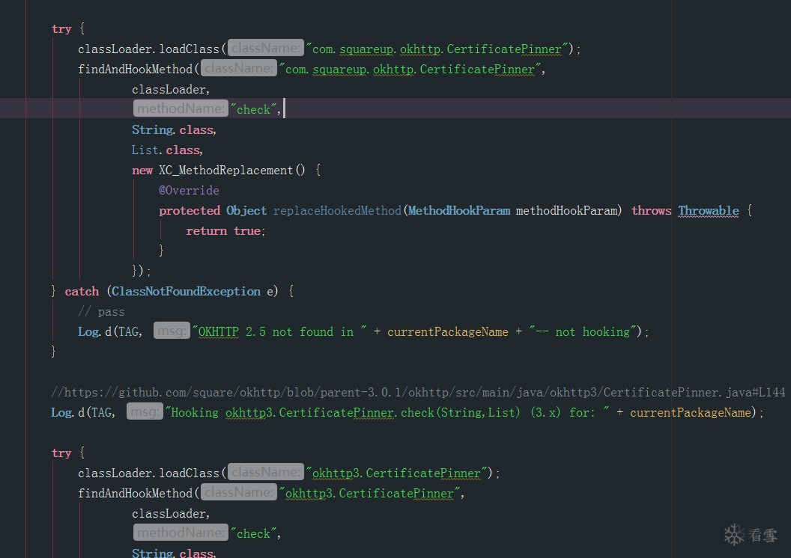
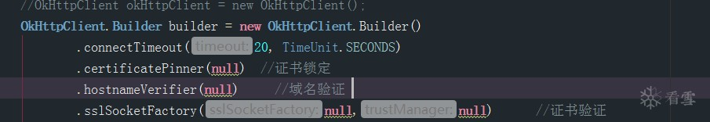
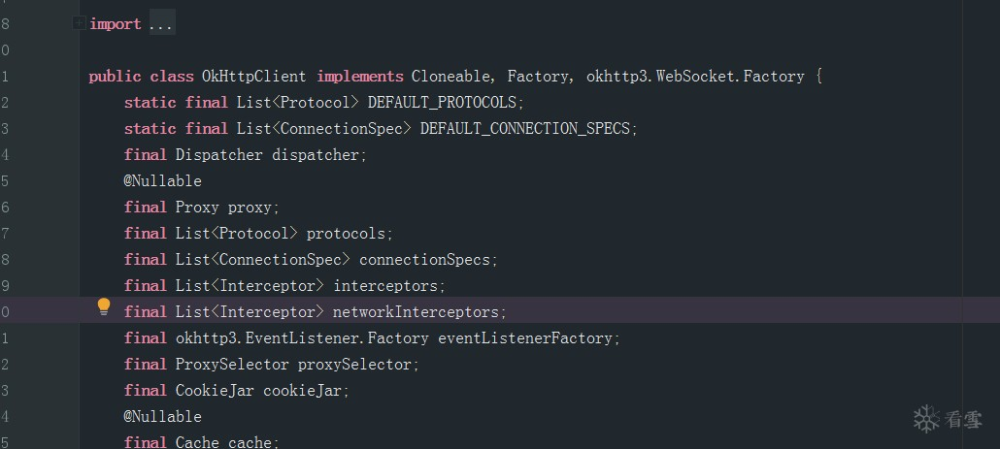
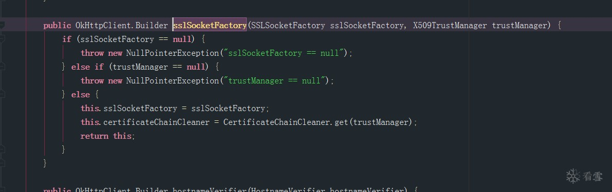
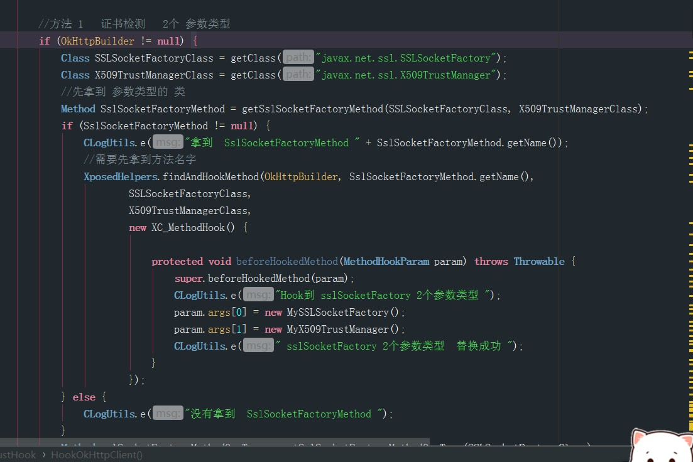
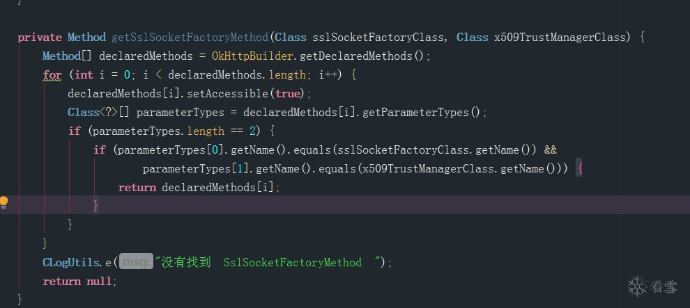

> 工具原帖地址：https://bbs.pediy.com/thread-254114.htm
> 工具作者：珍惜Any

在我们日常的Android Re中，经常做的第一件事是抓流量包，很多App在抓包的时候因为做了本地证书检测，我们会用JustTrustMe这个插件干掉本地的证书检测，但是有很多的App都是混淆的。原版JustTrustMe中包名类名是写死的，这就导致很多混淆后的App是无效的，出现断流，无响应等情况。

这时如果可以做到自识别类名的话就方便很多。

这个工具可以通过诸如参数类型、返回值、接口特征等方法批量自动识别类名，并对方法进行hook

下载地址见原帖地址

以下是原帖引用，防止帖子丢失

> 抓包 往往是逆向分析的 第一步 
>
> 很多的 App 在 抓包的 时候 会断流 因为本地 做了 证书检测 这个时候 我们通常都会 会使用JustTrustMe 干掉 本地的 证书检测
>
> 但是 这个时候弊端就出来了 很多 app 是混淆的 
>
> 在 JustTrustMe 的 源码里 
>
> 
>
> 路径都是写死的 也就导致 很多 混淆了的 App 是无效的 
>
> 出现 抓包断流 无响应等等 
>
> 这个时候 如果 可以 做到 自识别类名的话 就会方便很多 而不需要 静态分析 就可以直接 定位 
>
> 检测证书就那几种办法 就拿常用的 okHttp框架来说 
>
> 
>
> 我想了很久，通过什么办法定位，字符串搜索，opcode，字符串搜索还需要写一个文件管理器，类似MT那种搜索smali文件，根据特征字符串，麻烦，opcode虽然一样，但是操作数不一样，String在dex里面的index不同，导致操作数不同，有一天忽然灵光一现，可以遍历app当前系统的classloader里面全部的类名，找到和okHttp有关系的类名，根据类的一些特征，比如，父类对象名字，接口信息， 字段信息，方法参数信息，每一个参数的类型，
>
> 我是在application的oncreate后面执行的遍历，这个时候壳的dex已经释放到内存里，原版本 JustTrustMe 是在attach里面，这个方法很多壳没有进行解密，所以也会失效，（外国壳很少，可能没考虑到吧）
>
> 比如获取 OkHttpClient 来说 
>
> 
>
> 大家 可以 找一下他的 特征 接口类是三个 6个 集合类型 ，四个final类型 另外两个是 final并且是 static类型 并且 在 okHttp 包下就可以完美定位到 这个类的 名字 
>
> 利用 Xposed 对里面的方法进行 批量 Hook 
>
> 定位方法的办法也有很多  参数类型 返回值 等 比如 下面的方法 
>
> 
>
> 参数1 和参数2 都是 JDK里面的方法是不可以被混淆的 只需要反射即可拿到  
>
> 
>
> 对 参数1 和 参数2 进行比较 
>
> 
>
> 将参数 替换成 自己的 自定义的  无检测即可 
>
> 因为 需要 初始化大量的类 
>
> 所以 我做了选择 需要先打开 App 选择对应的 App名字 在开启抓包软件 开启 App即可 即可 
>
> 下载地址 在附件
>
> 文外言：
>
> 后期 我会给大家介绍 ， 自动化爬虫机 ， 利用 Hook抓包技术 直接把抓到的数据进行 转发 到自己服务器 
>
> 以及，通用算法服务器 搭建等 ，再也不用担心 遇到 LLVM的 So 了 
>
> 如果需要 App xy 等级 安全分析测试的 可以 私聊我 
>
> 会用 一些特殊办法对 App的 net安全 进行评测 提 出 解决办法 和复现步骤 和建议等 。
>
> ---------------------------- 更新 
>
> 发现 模块如果混淆了 有的 App会出现找不到类的情况 以更新
>
> 
>
> 上传的附件：
>
> - [ JustMePlush--8.25.0.10.apk ](2020-04-26-auto_hook_JustTrustMe.assets/JustMePlush--8.25.0.10.apk)（1.20MB，1409次下载）
